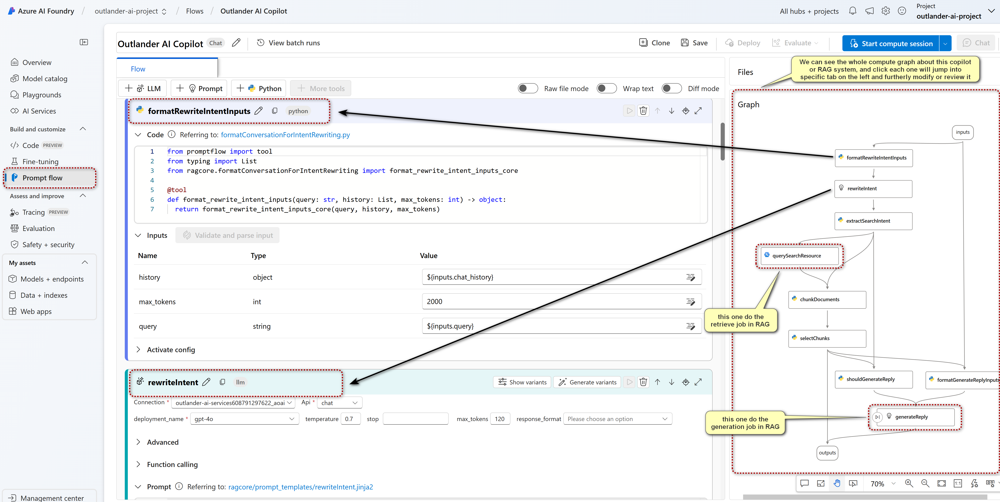
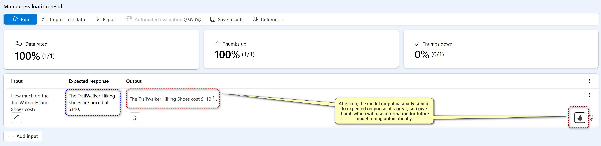
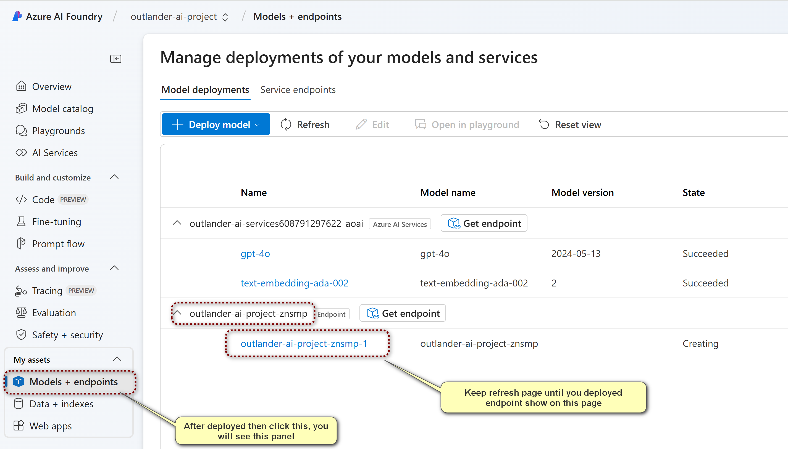

# Custom Copilot with Azure

### Project Overview

These project instructions will guide you through creating and deploying a custom AI copilot using Azure AI Studio. Follow the steps below carefully, and be sure to complete each deliverable for submission.

In this project, you will:

1. Create an AI Studio project and hub.
2. Deploy an AI model and upload product data for indexing.
3. Build and test a custom copilot app using Prompt Flow.
4. Evaluate the app with both automated and manual prompt evaluation.
5. Deploy and test the copilot application.

### Step-by-Step Guide

#### 1. Create an AI Studio Hub and Project

- Log in to [Azure AI Studio](https://ai.azure.com/).

  

- Click **Create Project**, name your project (`outlander-ai-project`), and create a new hub (`outlander-ai-hub`).

  

- When we first time create this project and not create hub yet, after click **Customize**, we will customize below settings. For  key settings in below you can custom by the instruction.

  

- Leave default configurations unless necessary adjustments are needed(below is my settings), and click **Next** in below.

  


- Ensure you have an **Azure AI Search** service for indexing data. And finally review the information and click **Create**

  

  

#### 2. Deploy an AI Model

- With your project selected, go to **Models + endpoints**.

  

- Click **+Deploy Model**, choose a base model like `gpt-4o`, and confirm the deployment.

  

  

  

  

  

#### 3. Upload Product Data to Azure AI Studio

- Download and unzip the `product-info.zip` from [this GitHub link](https://github.com/Azure-Samples/rag-data-openai-python-promptflow/tree/main/tutorial/data).

- In AI Studio, select the **Data + indexes** blade and click **+New Data**.

  

- Upload the unzipped product data files or connect to your storage account if preferred.

  

  

  

- After upload files, you can see the files structure in **Data + indexes** panel.

  

#### 4. Create an AI Search Index

- Create a Embedding model, we can transform the document (uploaded above) to dense embedding which we can use it in RAG system later. Like procedure created for `gpt-4o`, we choose `Models + endpoints` >>> `Deploy model` >>> `Deploy base model` in sequentially, and choose `text-embedding-ada-002` model to create.

  

- Still you can custom below settings, but i leave here by default and click **Deploy**

  

- After deployed, we can see the model in the service we created before.

  

- Go to the **Data + indexes** blade and click **+New Index** after **Indexes**

  

  

- Select **Data in Azure AI Studio** as the data source, choose the uploaded data, and proceed.

  

  

  

- Choose your deployed model for text embeddings and create the index.

  

  

  

  

#### 5. Build the Copilot App

- Navigate to the **Chat** blade under Project Playground.

  

- Select your deployed model and add your data by choosing the created index.

  

  

- Click **Prompt Flow**, name your flow (e.g., `Outlander AI Copilot`), and open it.

  

  

- Review and understand the default components, such as data retrieval and response generation.

  

#### 6. Test the Copilot

- Start a compute session by clicking **Start compute session**.

  

- Test the copilot by entering sample questions such as:

  > Below questions basically stick with the documents we uploaded, so ideally it will reply the relevant response based the document that is purpose of RAG.

  - `How much do the TrailWalker Hiking Shoes cost?`

    

  - `Which tent is the most waterproof?`

    

  - `Can the warranty for TrailBlaze pants be transferred?`

    

- After test, click **Save** for this copilot.

#### 7. Perform Automated Prompt Evaluation

- Create a JSONL or CSV file with evaluation questions and answers (see below for format).
  > [Sample Evaluation Data (JSONL format)](./data/qa_evaluation_data.jsonl)
  >
  > ```
  > {"chat_input": "Which tent is the most waterproof?", 
  > "truth": "The Alpine Explorer Tent has the highest rainfly waterproof rating at 3000m", 
  > "chat_history": []}
  > {"chat_input": "How much do the TrailWalker Hiking Shoes cost?", 
  > "truth": "The TrailWalker Hiking Shoes are priced at $110", 
  > "chat_history": []}
  > ```
  >
  > [Sample Evaluation Data (CSV format)](./data/qa_evaluation_data.csv)
  >
  > | chat_input                                      | truth                                                        | chat_history |
  > | ----------------------------------------------- | ------------------------------------------------------------ | ------------ |
  > | Which  tent is the most waterproof?             | The Alpine Explorer Tent has the  highest rainfly waterproof rating at 3000m | []           |
  > | How  much do the TrailWalker Hiking Shoes cost? | The TrailWalker Hiking Shoes are  priced at $110             | []           |


- In **Prompt Flow**, click **Evaluate**, choose **Automated evaluation**, and then and use your dataset.

  

  

  

- Map inputs and outputs and **Submit** on the next page and then run the evaluation.

  

  

#### 8. Manual Prompt Evaluation

- Go to **Evaluation** in AI Studio and Create a **Manual evaluations**

  

- Add questions and expected responses and run evaluations, right here I only add one.

  - Input: `How much do the TrailWalker Hiking Shoes cost?`
  - Expected response: `The TrailWalker Hiking Shoes are priced at $110.`

  

-  After run, you can provide feedback using thumbs up or down for the response.
  

#### 9. Deploy the Copilot

- In **Prompt Flow**, click **Deploy** and name the deployment.

  

  

- Verify the deployment details and create, finally you will see the created endpoint in below image.

  

- Finally, click the created endpoint `outlander-ai-project-znsmp-1` and you will see ready-to-use deployment info

  

- And we can test some question.

  

🎉Good luck, and enjoy building your custom Azure AI copilot✨!

